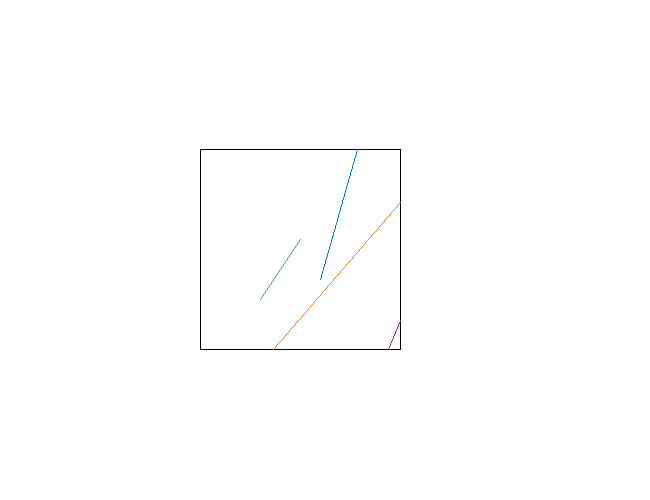
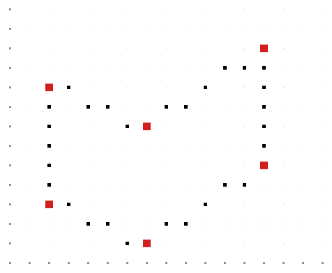
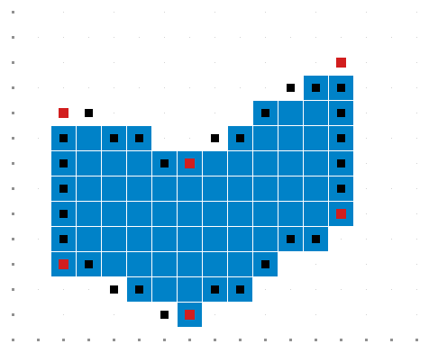

# Algoritmos de Rasterização em C++

Implementação acadêmica, em C++17, de quatro algoritmos fundamentais de Computação Gráfica: **Bresenham**, **Cohen-Sutherland**, desenho de polígonos por segmentos rasterizados e preenchimento **Scanline**.

> Projeto colaborativo desenvolvido para a disciplina de Computação Gráfica. O código foi organizado para estudo, reprodução dos testes e demonstração dos resultados.

## Algoritmos implementados

| Exercício | Algoritmo | Demonstração |
|---:|---|---|
| 1 | Ponto médio / Bresenham para retas em todos os octantes | Oito casos de teste, incluindo diagonais, verticais e horizontais. |
| 2 | Cohen-Sutherland para recorte de segmentos | Aceitação, rejeição e recorte dos segmentos `EF`, `AB`, `CD`, `GH` e `IJ`. |
| 3 | Desenho de polígonos com Bresenham | Hexágono do enunciado e pentágono de escolha livre. |
| 4 | Preenchimento Scanline com ET e AET | Preenchimento do hexágono e de um quadrado de escolha livre. |

## Evidências visuais

| Bresenham | Cohen-Sutherland |
|---|---|
|  |  |

| Polígono com Bresenham | Preenchimento Scanline |
|---|---|
|  |  |

A imagem do Exercício 3 mostra somente a **fronteira** do polígono. Já a imagem do Exercício 4 mostra o **interior preenchido**; a região azul é produzida pelo algoritmo Scanline.

## Como executar

### CMake - recomendado no Windows, Visual Studio e VS Code

```bash
cmake -S . -B build
cmake --build build --config Release
```

Após a compilação, execute todos os exercícios ou escolha um deles:

```bash
# Linux/macOS
./build/rasterizacao todos

# Windows com gerador Visual Studio
.\build\Release\rasterizacao.exe todos

# Substitua "todos" por 1, 2, 3 ou 4 para executar um exercício específico.
```

### Visual Studio Code no Windows

O VS Code é um editor e precisa de um compilador C++ instalado. A opção recomendada é instalar, pelo **Visual Studio Installer**, a carga **Desenvolvimento para desktop com C++**. Em seguida, abra o projeto pelo **Developer PowerShell for VS 2022**:

```powershell
cd caminho\para\algoritmos-rasterizacao-cpp
code .
```

No terminal integrado do VS Code, `cl` deve exibir a versão do compilador MSVC. Caso o comando não seja reconhecido, o MSVC não está instalado ou o VS Code foi aberto pelo PowerShell comum.

## Estrutura

```text
.
├── src/          # Implementações dos algoritmos e ponto de entrada
├── include/      # Interfaces e tipos compartilhados
├── docs/         # Relatório técnico e imagens de evidência
├── resultados/   # Registro textual da execução validada
├── CMakeLists.txt
└── Makefile
```

A função de Bresenham é um módulo compartilhado entre os Exercícios 1 e 3. O mesmo polígono do Exercício 3 é reutilizado e preenchido no Exercício 4.

## Documentação e resultados

O [relatório técnico](docs/relatorio-tecnico.md) descreve arquitetura, testes, limitações, decisões de implementação e referências. A [execução consolidada](resultados/execucao_completa.txt) registra os resultados automáticos dos quatro exercícios.

## Autoria e créditos

| Integrante | Responsabilidade principal |
|---|---|
| Gabriel Hochmann Alves | Exercícios 1 e 3; integração e documentação. |
| Diogo Rafael Jardim Melo Pasa | Exercício 2; documentação. |
| Iuri Cordeiro | Exercício 4. |

