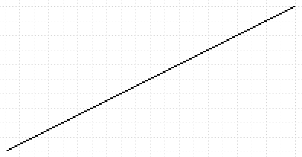
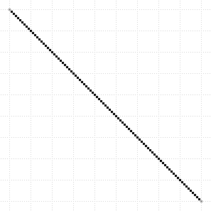
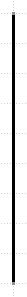
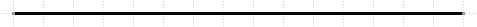
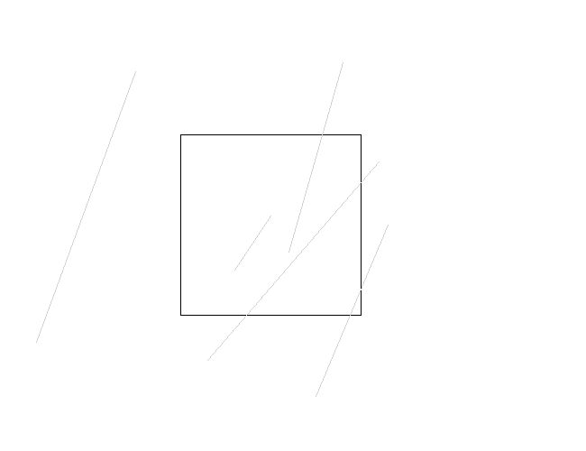
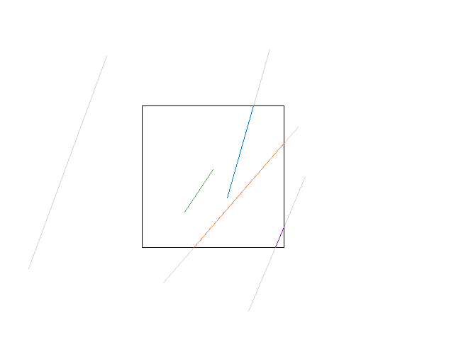
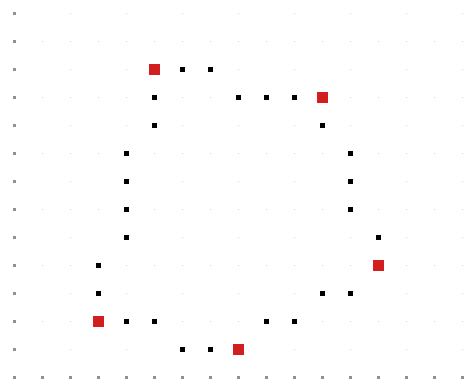
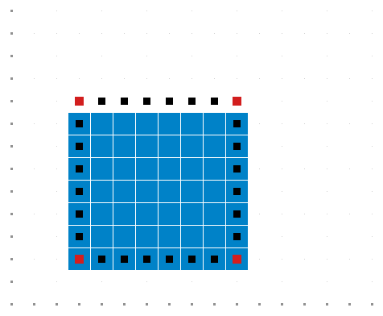

# Relatório técnico: Algoritmos de Rasterização

## Identificação

| Campo | Informação |
|---|---|
| Linguagem | C++17 |
| Escopo | Rasterização de retas, recorte, desenho de polígonos e preenchimento de polígonos. |
| Autoria | Gabriel Hochmann Alves; Diogo Rafael Jardim Melo Pasa; Iuri Cordeiro. |
| Tipo de projeto | Trabalho acadêmico colaborativo de Computação Gráfica. |

## 1. Objetivo

O projeto implementa quatro algoritmos de Computação Gráfica em uma grade discreta de pixels. O objetivo é demonstrar como primitivas geométricas podem ser convertidas em posições de amostragem, sem delegar a rasterização a funções prontas de bibliotecas gráficas.

A versão pública preserva os algoritmos e testes da entrega acadêmica, mas organiza o código em módulos. A função de Bresenham ficou em uma única fonte e é reutilizada para evitar duplicação; os módulos de Cohen-Sutherland e Scanline mantêm sua lógica de códigos de região, ET e AET.

## 2. Arquitetura

| Módulo | Responsabilidade |
|---|---|
| `src/bresenham.cpp` | Rasterização de segmentos de reta com o algoritmo do ponto médio. |
| `src/exercicio1_ponto_medio.cpp` | Casos de teste exigidos para Bresenham e geração de evidências. |
| `src/exercicio2_cohen_sutherland.cpp` | Recorte contra janela retangular, com saídas de entrada, resultado e comparação. |
| `src/exercicio3_poligonos.cpp` | Desenho de contornos poligonais usando o módulo Bresenham. |
| `src/exercicio4_scanline.cpp` | Preenchimento com Tabela de Arestas e Tabela de Arestas Ativas. |
| `src/imagem_ppm.cpp` | Escrita de imagens PPM usadas na geração das evidências. |
| `src/main.cpp` | Seleção de um exercício específico ou execução de todos. |

A modularização não altera a teoria dos exercícios. Ela evita duas cópias independentes da mesma rotina de Bresenham e permite que a mesma lista de vértices seja usada para desenhar a fronteira no Exercício 3 e preencher o interior no Exercício 4.

## 3. Exercício 1: Ponto médio / Bresenham

A rotina `pontoMedio()` trabalha com coordenadas inteiras, diferença absoluta dos eixos e um termo de erro incremental. Ela inclui os pontos inicial e final e trata todos os sentidos de percurso. A proposta original de Bresenham usa cálculo incremental sem multiplicação ou divisão no laço principal [1].

| Caso | Chamada | Pixels gerados | Resultado |
|---:|---|---:|---|
| 1 | `pontoMedio(10,100,100,10)` | 91 | Aprovado |
| 2 | `pontoMedio(100,10,10,100)` | 91 | Aprovado |
| 3 | `pontoMedio(200,100,1,1)` | 200 | Aprovado |
| 4 | `pontoMedio(1,1,200,100)` | 200 | Aprovado |
| 5 | `pontoMedio(200,100,200,10)` | 91 | Aprovado |
| 6 | `pontoMedio(200,10,200,100)` | 91 | Aprovado |
| 7 | `pontoMedio(50,100,200,100)` | 151 | Aprovado |
| 8 | `pontoMedio(200,100,50,100)` | 151 | Aprovado |

A validação automática verifica vetor não vazio, coincidência dos extremos e adjacência entre pixels consecutivos.

### Galeria completa dos oito testes

| Testes 1 e 2 | Testes 3 e 4 |
|---|---|
|  |  |
|  |  |

| Testes 5 e 6 | Testes 7 e 8 |
|---|---|
|  |  |
|  |  |

## 4. Exercício 2: Cohen-Sutherland

O algoritmo classifica cada extremo de segmento em relação a uma janela retangular usando quatro bits: esquerda, direita, inferior e superior. Quando ambos os códigos são zero, o segmento é aceito trivialmente; quando possuem um bit externo em comum, é rejeitado trivialmente. Nos demais casos, um extremo é substituído pela interseção com uma borda da janela [2].

A janela usada é `xmin = 200`, `ymin = 150`, `xmax = 400` e `ymax = 350`.

| Segmento | Resultado |
|---|---|
| EF | Rejeitado por estar totalmente fora da janela. |
| AB | Aceito integralmente. |
| CD | Recortado na borda superior. |
| GH | Recortado nas bordas inferior e direita. |
| IJ | Recortado nas bordas inferior e direita. |

As evidências visuais distinguem: entrada sem recorte, resultado recortado e comparação. A imagem do resultado final mostra apenas os trechos aceitos; os segmentos externos não são exibidos nela.

### Galeria das três etapas do recorte

| Entrada sem recorte | Resultado após Cohen-Sutherland |
|---|---|
|  |  |



*Comparação: segmentos originais em cinza claro e trechos visíveis em cores.*

## 5. Exercício 3: Desenho de polígonos

O polígono é representado por uma lista ordenada de vértices. Cada vértice é ligado ao próximo por Bresenham, e o último é ligado ao primeiro para fechar a fronteira.

| Polígono | Vértices | Resultado |
|---|---|---|
| Hexágono do enunciado | `(2,3)`, `(7,1)`, `(13,5)`, `(13,11)`, `(7,7)`, `(2,9)` | Fechamento aprovado. |
| Pentágono de escolha livre | `(3,2)`, `(8,1)`, `(13,4)`, `(11,10)`, `(5,11)` | Fechamento aprovado. |

### Evidências dos dois polígonos

| Polígono do enunciado | Polígono de escolha livre |
|---|---|
|  |  |

O Exercício 3 desenha apenas a **fronteira**. O preenchimento do interior pertence ao Exercício 4.

## 6. Exercício 4: Preenchimento Scanline

O algoritmo de Scanline percorre a figura por linhas horizontais. A Tabela de Arestas (ET) agrupa as arestas pelo menor valor de `y`; a Tabela de Arestas Ativas (AET) mantém as que cruzam a linha atual. As interseções são ordenadas por `x`, e os intervalos entre pares de interseções são preenchidos [3].

| Polígono preenchido | Resultado |
|---|---|
| Hexágono do enunciado | Área interna preenchida em azul; contorno preto e vértices vermelhos usados como referência visual. |
| Quadrado de escolha livre | Área interna preenchida de forma contínua. |

O algoritmo usa a convenção de preencher a borda inferior e excluir a borda superior. Essa regra evita dupla contagem de pixels em arestas e vértices compartilhados; por isso, o quadrado mostra preenchimento até a última scanline interna, enquanto seu contorno superior permanece apenas como fronteira visual.

### Evidências dos dois preenchimentos

| Hexágono do enunciado | Quadrado de escolha livre |
|---|---|
|  |  |

## 7. Compilação e execução

### CMake

```bash
cmake -S . -B build
cmake --build build --config Release
```

### Execução

```bash
# Linux/macOS
./build/rasterizacao todos

# Windows com gerador Visual Studio
.\build\Release\rasterizacao.exe todos
```

Os valores `1`, `2`, `3` e `4` podem substituir `todos` para executar somente um exercício.

No Windows com VS Code, é necessário ter um compilador instalado. A configuração recomendada é MSVC, disponível na carga **Desenvolvimento para desktop com C++** do Visual Studio Installer. O VS Code deve ser aberto pelo Developer PowerShell do Visual Studio para que `cl` esteja disponível no terminal integrado.

## 8. Resultados de validação

A compilação de validação usou C++17, `-Wall`, `-Wextra`, `-pedantic` e sanitizadores de endereço e comportamento indefinido. Os quatro exercícios foram executados em sequência sem erros reportados. O registro completo está em [`../resultados/execucao_completa.txt`](../resultados/execucao_completa.txt).

| Verificação | Resultado |
|---|---|
| Compilação com avisos rigorosos | Aprovada sem avisos. |
| Sanitizador de endereço | Nenhum erro reportado. |
| Sanitizador de comportamento indefinido | Nenhum erro reportado. |
| Bresenham | Oito testes aprovados. |
| Cohen-Sutherland | Segmentos de teste classificados e recortados corretamente. |
| Polígonos com Bresenham | Fechamento aprovado nos dois polígonos. |
| Scanline | Hexágono e quadrado preenchidos. |

## 9. Limitações

| Exercício | Limitação conhecida |
|---|---|
| Bresenham | Opera com coordenadas inteiras e não aplica antialiasing. |
| Cohen-Sutherland | Trata apenas segmentos de reta e janela retangular alinhada aos eixos. |
| Desenho de polígonos | Não valida auto-interseções ou repetição de vértices. |
| Scanline | Validado para polígonos simples deste trabalho; não implementa tratamento explícito de furos, auto-interseções ou regras alternativas de preenchimento. |

## 10. Referências

[1] BRESENHAM, J. E. **Algorithm for computer control of a digital plotter**. *IBM Systems Journal*, 1965. [ACM Digital Library](https://doi.org/10.1145/280811.280913).

[2] BELL, John. **Intro to Computer Graphics: Clipping**. University of Illinois Chicago. [Material de referência](https://www.cs.uic.edu/~jbell/CourseNotes/ComputerGraphics/Clipping.html).

[3] BELL, John. **Intro to Computer Graphics: Polygon Filling**. University of Illinois Chicago. [Material de referência](https://www.cs.uic.edu/~jbell/CourseNotes/ComputerGraphics/PolygonFilling.html).
